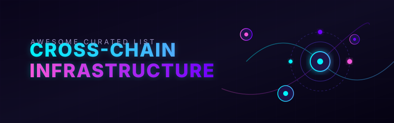

  

# Awesome Cross-Chain Infrastructure 🌉

> A curated list of awesome cross-chain interoperability protocols, decentralized messaging layers, blockchain bridging frameworks, and open-source smart contracts enabling arbitrary message passing.

## 🔍 Overview of Blockchain Interoperability

**Cross-Chain Infrastructure** (also referred to as interoperability protocols, messaging layers, or bridging frameworks) enables secure communication, token transfers, and arbitrary contract calls across disparate blockchain networks (EVM, Cosmos, Solana, etc.). Leading enterprise and decentralized solutions include LayerZero, Axelar, Wormhole, Chainlink CCIP, Hyperlane, Connext (Everclear), Socket, LI.FI, Router Protocol, and deBridge.

This repository serves as a **curated directory** of major hosted platforms, SaaS APIs, and open-source implementations. The emphasis is on **open-source software (OSS)** and permissionless protocols that developers can audit, self-host components of, or extend for multichain dApp development.

## 🏢 SaaS / Hosted Platforms & Major Protocols

| Platform / Protocol | Description | Pricing Structure | Free Tier / Limits | Company Size / Valuation (USD) |
| :--- | :--- | :--- | :--- | :--- |
| **[Chainlink CCIP](https://chain.link/cross-chain)** | Cross-Chain Interoperability Protocol from Chainlink, focused on secure messaging and token transfers with a dual DON + Risk Management Network architecture. Popular for institutional and high-value use cases. | Pay-per-transaction (execution gas + CCIP premium paid in LINK or wrapped native tokens). No subscription fees. | Unlimited free use on public testnets. | ~$7 Billion |
| **[LayerZero](https://layerzero.network/)** | Omnichain messaging protocol with modular Decentralized Verifier Networks (DVNs), OFT (Omnichain Fungible Token) standard, and broad chain coverage. Widely used for cross-chain applications and token transfers. | Pay-per-transaction (gas + DVN/executor fees). No subscription or upfront licensing costs. | Unlimited free deployments and testing on testnets. | ~$3 Billion |
| **[Wormhole](https://wormhole.com/)** | Cross-chain messaging and bridging protocol secured by a Guardian network. Excellent multi-ecosystem support (including Solana and other non-EVM chains) with Native Token Transfers (NTT). | Pay-per-transaction (relayer fees on target chain). No subscription or integration costs. | Unlimited free use on public testnets. | ~$2.5 Billion |
| **[Axelar](https://axelar.network/)** | Full-stack interoperability network using proof-of-stake validators, General Message Passing (GMP), and Interchain Token Service (ITS). Strong Cosmos ↔ EVM connectivity. | Pay-per-transaction (gas on destination + Axelar network fee). No subscription or licensing fees. | Unlimited free use on public testnets. | ~$1 Billion |
| **[LI.FI](https://li.fi/)** | Aggregation and routing layer that sits on top of multiple bridges and messaging protocols to provide optimal cross-chain routes. | Free to integrate. Charges 0.25% fee on swaps/bridges. Custom enterprise plans for high-volume integrators. | Free API key with default 100–200 requests/minute. Unauthenticated tier limited to 75 requests/2 hours for quotes. | ~$120 Million |
| **[deBridge](https://debridge.finance/)** | Cross-chain messaging and interoperability protocol. | Pay-per-transaction (flat validator fee + 0.04% variable protocol fee + solver gas/spread). No subscription/license fees. | Free API integration; unlimited free use on public testnets. | ~$100 Million |
| **[Hyperlane](https://www.hyperlane.xyz/)** | Modular, permissionless interoperability framework with Interchain Security Modules (ISMs) that apps can customize. Strong emphasis on open-source and permissionless chain expansion. | No protocol fees. Users pay self-configured relayer gas costs. | Completely free to self-host relayers/validators; unlimited free testnet deployments. | ~$50 Million |
| **[Connext](https://www.connext.network/)** | Modular cross-chain messaging and liquidity network (often used with intent-based or optimistic approaches). | Pay-per-transaction (router fees + network gas). No subscription fees. | Unlimited free use on public testnets. | ~$50 Million |
| **[Socket](https://www.socket.tech/)** | Chain-abstraction and interoperability infrastructure for seamless multi-chain experiences. | Pay-per-transaction (bridge fee + gas). No subscription fees. | Unlimited free use on public testnets. | ~$30 Million |
| **[Router Protocol](https://routerprotocol.com/)** | Cross-chain infrastructure focused on messaging and asset transfers. | Pay-per-transaction (gas fee on Router Chain + gas on destination). No subscription fees. | Unlimited free use on public testnets. | ~$20 Million |

## 🔓 Open-Source Software & Protocols

### 🚀 Leading Open / Permissionless Frameworks
- **[Wormhole](https://github.com/wormhole-foundation)**  — Core messaging contracts, Guardian-related components, and Native Token Transfers (NTT) implementations are publicly available.
- **[LayerZero](https://github.com/LayerZero-Labs)**  — Core endpoint contracts, OFT standards, and related tooling are open source. Modular security via DVNs allows applications to choose their own verification sets.
- **[Hyperlane](https://github.com/hyperlane-xyz)**  — Fully open-source (Apache 2.0 / MIT components), modular interoperability framework. Features permissionless deployment to new chains, customizable Interchain Security Modules (ISMs), Warp Routes for tokens, and broad multi-VM support. Frequently highlighted as one of the most open and developer-controlled options.
- **[Axelar](https://github.com/axelarnetwork)**  — Open-source components for the Axelar network, GMP, and related tooling.

### 🌐 Protocol-Level & Ecosystem Native Interoperability
- **[OP Superchain / OP Stack native interop](https://www.optimism.io/)**  — Emerging native interoperability features within the Optimism Superchain ecosystem.
- **[Polkadot XCM (Cross-Consensus Messaging)](https://wiki.polkadot.network/docs/learn-xcm)**  — Native messaging format for the Polkadot/Kusama ecosystem enabling secure communication between parachains and the relay chain.
- **[Cosmos IBC (Inter-Blockchain Communication)](https://github.com/cosmos/ibc)**  — The standard open protocol for sovereign chain-to-chain communication in the Cosmos ecosystem. Light-client based, highly secure, and widely battle-tested. No central vendor.

### 🛠️ Other Notable Open-Source or Modular Projects
- **[Across Protocol](https://github.com/across-protocol)**  — Intent-based bridging focused on fast, capital-efficient transfers (particularly strong on Ethereum L2s).
- **[Hop Protocol](https://github.com/hop-protocol)**  — Optimistic rollup-focused bridging and liquidity network.
- Various light-client, optimistic, and ZK-based bridge research implementations available on GitHub (search for “cross-chain messaging”, “optimistic bridge”, or “IBC light client”).
- Aggregation and routing layers (such as open components related to LI.FI-style routing) and solver/intent frameworks continue to appear as open-source projects.

### 💡 Typical Open-Source Approach
Developers often combine:
- A messaging layer (Hyperlane, LayerZero contracts, Wormhole, or IBC)
- Token standards (OFT, Warp Routes, NTT, ITS, or native mint/burn)
- Optional intent/solver layers (Across-style) for better UX
- Self-operated or community relayers/validators where the protocol permits

This gives maximum auditability and reduces reliance on any single commercial operator.

---

**🤝 How to contribute**  
Fork this repository, add a new project (with link + short description + category), and open a pull request.  
Prefer actively maintained open-source protocols, smart-contract frameworks, or tooling that enable secure cross-chain messaging or asset transfers.

**📄 License**  
This list is public domain / CC0. Feel free to copy into your own awesome list or README.

Star the projects you find useful — open cross-chain infrastructure continues to mature quickly! 🌉
